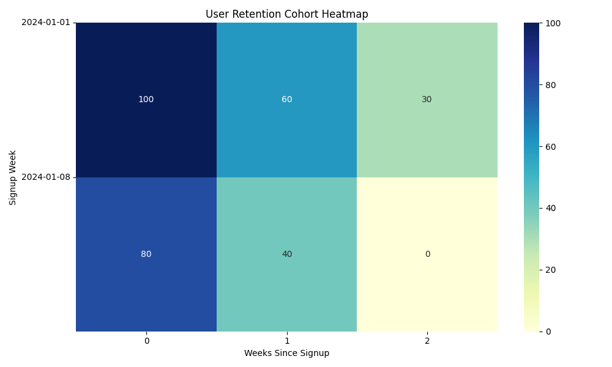
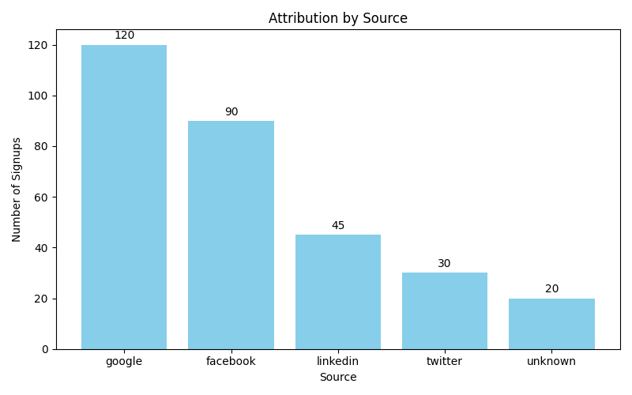

# 🧠 PostHog Demo: User Attribution & Cohort Dashboard (Portfolio Project)

This project demonstrates how to use **PostHog**, **BigQuery-style SQL**, and data analytics techniques to analyze user behavior, marketing attribution, and retention cohorts.

It’s built using the **PostHog demo project**, with sample data and SQL queries that can be extended to real projects.

---

## 🔧 Tools Used

- [PostHog](https://posthog.com/) – Product analytics platform
- SQL (BigQuery-style)
- HTML + JavaScript (for event tracking example)
- Google Sheets or BigQuery (for analysis using exported data)

---

## 📈 What You'll Learn

- How to track and analyze user behavior events
- How to calculate retention cohorts using SQL
- How to identify traffic sources via attribution analysis
- How to build simple dashboards for user insights

---

## 🚀 Getting Started

### Step 1: Explore PostHog Demo Data
1. Sign up at [PostHog](https://app.posthog.com)
2. Click your profile picture > “Try the demo project”
3. Explore dashboards, events, and funnels

### Step 2: Export Demo Data
1. Go to **Events** tab
2. Filter or keep default data
3. Click “Export → CSV”
4. Save the file in `demo_data/posthog_export.csv`

---

## 🧪 Example SQL Queries

### 📊 Attribution by Source

```sql
SELECT 
  properties.$set_utm_source AS source,
  COUNT(*) AS signups
FROM `posthog_export`
WHERE event = 'signup'
GROUP BY source
ORDER BY signups DESC;


### 🔁 Retention Cohort Analysis

We calculated weekly retention cohorts based on user signups and activity logs.

**What this tells us:**
- Each row shows users who signed up in a given week.
- Each column shows how many of those users came back after 1, 2, 3... weeks.
- The heatmap helps visualize user drop-off over time.

**Why it's valuable:**
Retention analysis is critical for understanding user engagement and product stickiness.

📊 


### 📍 Attribution Analysis

We analyzed user acquisition sources using `utm_source` and signup events.

**What it shows:**
- Which channels (like Google, Facebook, etc.) drive the most signups
- Useful for budget allocation and channel optimization

**How:**
- Used DuckDB SQL to group `user_signed_up` events by `utm_source`
- Exported as CSV
- Visualized as bar chart

📊 

